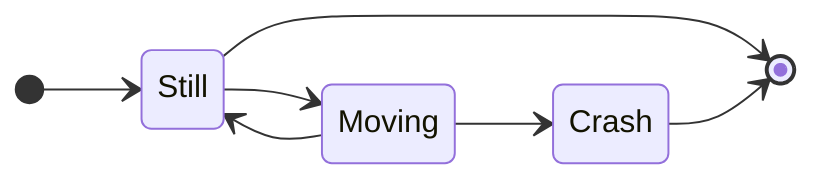

# 小谷研発表資料作成マニュアル

小谷先生によく言われることをまとめる．

学生視点で大丈夫だと思っても小谷先生視点でダメなことがあるので，ダメなケースも併記する．

# 1. Overall

主に全体的なフォーマットについて

発表資料も論文と同じ構成にする必要がある．

学術論文の発表会なので，**スライドの縦横比は4:3**で作成する．

## 1.1. 論文の構成の遵守

章，節，項の順に階層構造を作ること．それに伴い，**話の流れを意識して構成**する．次に例を示す．

```
1. はじめに
    1.1. 背景
    1.2. 先行研究
    1.3. 問題，課題点
    1.4. 研究の目的，目標
2. 原理，手法
    2.1. 原理1
    2.2. 原理2
3. 実験
    3.1. 実験環境
    3.2. 実験1の流れ
        3.2.1. 実験1の結果の予測
    3.3. 実験2の流れ
        3.3.1. 実験2の結果の予測
4. 結果
    4.1. 実験1の結果
    4.2. 実験2の結果
5. 考察
    5.1. 実験1の結果に対する考察，予測との差分の評価
    5.2. 実験2の結果に対する考察，予測との差分の評価
6. まとめ
    6.1. 総合評価
7. 今後の予定(中間発表のみ特に必要)
```

### 1.1.1. ダメな例 - 池村のケース

```
    2.2. 原理2
        3.0.1. 前実験-原理，実験手法
        3.0.2. 前実験-結果
    3.1. 実験手法
```

改善結果

```
    2.2. 原理2
3. 実験
    3.0. 前実験の意義
        3.0.1. 前実験-原理，実験手法
        3.0.2. 前実験-結果
    3.1. 実験手法
```

「章」を飛ばしていきなり「節，項」が出てきたことを指摘された．改善結果，「章，節，項」の順に並んだ．

**節(e.g. "2.1.")**のスライドがあるならその前に必ず**章(e.g. "2.")**のスライドが必要である．

同様に，**項(e.g. "2.1.1.")**のスライドがあるならその前に**節(e.g. "2.1.")**のスライドが必要である．

### 1.1.2. 話がつながっていない例

```
3. 実験
    3.1. データセット
```

データセットをいきなり出した例．このデータセットでないといけない理由を述べるのが先である．改善すると

```
3. 実験
    3.1. 実験の目標
    3.2. 目標達成のために必要なデータセット
```

にでもなるのだろうか．

## 1.2. ページ番号

ページ番号が無い場合と小さい場合は怒られが発生する．配置は右上でも右下でも可．

フォントサイズ**18以上**が推奨．池村は12で小さいと言われた．

スライドの内容に対して本質的ではないので文中のフォントの色よりも薄めの色にする．

## 1.3. スライドのバランス

右や左に偏りすぎているスライドは，その反対側に余白(Margin)ができるので指摘される．左右の余白が少なすぎても指摘された．適度に余白を埋めること．ここは常識の範囲で構成すれば良いが，思ったより小谷先生の感性次第で決まる．

## 1.4. 本質的でない内容は記述しない

主に発表では話す時間が限られているので，本質的でない内容は記述しないこと．

* 目次
* プログラムの動作環境(CPU, GPU, OS, Interpreter, Versions, etc...)

論文ではどちらも記述するはず．

# 2. 文字，文章

フォントサイズ，配色について．

## 2.0. 句読点

まだ怒られを観測していないポイント．

「、。」は習慣上あまり好まれないため，普通は「，．」を使う．

Windowsの方々は[Microsoft IMEの設定](https://faq.nec-lavie.jp/qasearch/1007/app/servlet/qadoc?QID=020458&p=2)からデフォルトの句読点を変更できる．

## 2.1. フォントサイズ

小さいフォントサイズでスライドを作ると，「自分の講義もこのサイズでスライドを作るぞ」って言われる．

* タイトル：最低26pt，どの文章のフォントサイズよりも大きく．
* 文章：最低20pt，普通は22pt~26pt．PowerPointのデフォルト設定が18ptなので必ず1サイズ大きくすること．
* 図中：12ptを切らなければ許される．普通は14pt~．
  * 図の枠線太さもデフォルトより大きくすること(2pt~)．

* キャプション：文章サイズよりも小さいぐらい．

## 2.2. 配色

文字色は背景の補色であればだいたいOK，背景色に近いのはNG．

HSV色空間上で[Adobe Color](https://color.adobe.com/ja/create/color-wheel)を使って確認しながらデザインを決めるのも一手．

## 2.3. 文章の表現に明確な区別をつけること

**説明(Describe, Explain)**と**箇条書き(Itemize)**や**列挙(Enumerate)**を記述するときは明確な区別が必要．

### 2.3.1. ダメな例 - 池村のケース

```
* Explain 1 Supercalifragilisticexpialidocious
* Explain 2 SupercolorpixelisticXDRidocious
* Item 1
* Item 2
```

のように説明の冒頭にも`・`を付けてしまっていた．

改善結果

```
  Explain 1 The longest English word in the world is "Supercalifragilisticexpialidocious" by Mary Poppins. Explain 2 It was impressed by the way it was adapted into "SupercolorpixelisticXDRidocious".
* Item 1
* Item 2
```

ちゃんと説明は説明で，列挙すべきものは冒頭の`・`で箇条書きスタイルでの記述を行うなど，**メリハリをつける**．

## 2.4. タイトルの付け方

スライドが表している内容とタイトルを一致させる．内容が遷移しているなら，タイトルも遷移させる．

### 2.4.1. 悪い例

* スライド10ページ目タイトル: 実験結果
* スライド11ページ目タイトル: 実験結果

改善結果

* スライド10ページ目タイトル: 実験結果1
* スライド11ページ目タイトル: 実験結果2

複数の実験結果が生じているので内容が遷移したとともに，タイトルも遷移した．

## 2.5. 定量的な説明を行う

「多い」「ちょっと減った」「だいたい$48[{\rm g}]$になった」など，口語をはじめ曖昧な表現はしない．

「$10[\%]$多い」「$8[{\rm pixel}]$減った」「$48\pm 3[{\rm g}]$となった」など，定量的な数値と並べて表現する．

## 2.6. 参考文献の記述方法

まだ怒られが発生していない箇所．引用符番号とその説明は一致させる．

余白と相談で，同じページに記述するか最後のページにまとめるか決める．どうやら小谷先生は同じページに記述する派らしい．

最近の論文には引用のためのフォーマットが書いてある．以下記述例．

> \[1]: Yoshiko Furusho, Kazunori Kotani, "Objective & Subjective Evaluation Models of Pencil Still Drawings for Art Education," DICTA 2017-2017 International Conference on Digital Image Computing: Techniques and Applications, 2017-, 1-5, 2017

引用符`""`の後にCommaをつけるか中につけるかはよく議論されるが基本的に後者を選ぶ．したがってauthor, "abcde," paper`となる．

# 3. 図，画像

ここは画像処理研である．ほとんどのスライドが画像で埋め尽くされるはずである．

当たり前だが，挿入する図の原理や意味を理解しておくこと．

言うまでもないがネットから拾ってきた画像の書体とスライドの書体が異なるものはパクっているとすぐバレる．スライドと図中で書体が統一できないのであれば，自作する他ない．

特に実験手法に手順が存在するなら，その手順をBlock Diagram/Flow Chartで記述する．後述のMermaidが便利．

## 3.1. 縦横比

画像サイズの変更をしようとしたときに，縦横比が変わってしまうことがある．

画像情報を歪めるのは画像加工の一種であるので捏造判定となり画像処理研でなくてもNG行為である．

画像サイズを変更するときはShiftキーを押しながらドラッグ＆ドロップをする．

画像の中央位置を変えずに縦横比を保ったままサイズ変更をする場合はShiftキーだけでなくControlキーも一緒に押すと良い．

## 3.2. キャプション

図や画像には，そのナンバリングと説明が必要である．

### 3.2.1 ダメな例1

「Fig. n: Result 1」

結果1の画像であるとキャプションを付けたものの，どういう実験をしてどういう結果が得られて何を表現しているか不明であるとのことで，説明不足であるとされた．適宜説明の必要あり．「画像1」なんて書いた日には何が起こるかわからない．誰が見てもわかるような情報は冗長である．

### 3.2.2. ダメな例2

同時に扱える比較可能な画像(e.g. 入力 - 出力，視点だけが違う画像，条件を変更しただけの画像など)に，別々のナンバリングをしている点．


改善結果


同時に扱うべき画像に同じ図番号を割り振った上で，**(a),(b)**や**(i),(ii)**のサブナンバリングを行う．

この効果として，改善前は同時に扱うべき画像には同じ説明がついてしまう問題があったが，それを図番号のあるキャプションに書き，差分だけをサブナンバーの後に記述できることが挙げられる．上の例では「Swapped Face」の文章が被っていたが，改善することでより詳細を記述できるようになった．これも序盤に挙げた論文の階層構造と同様，画像キャプションも階層構造を成していることで整然性が向上する．

## 3.3. 画像の解像度

解像度の低いガビガビ画像は指摘される．ネットから拾ってきた画像の解像度には注意して貼り付けを行うこと．

ネットから拾ってきた画像の解像度が低い場合は自作した方が良い．

### 3.3.1. グラフ画像の自作

自作の腰が重いのは特にグラフ画像である．しかし，グラフ画像から座標を抽出してCSVに変換することができれば，自分の好きなツールでグラフ化できるはずである．

座標抽出に[WebPlotDigitizer](https://apps.automeris.io/wpd/)なるオンラインツールがある．実際にグラフ画像を自作した例を次に示す．


Matplotlibである必要はなく，CSVデータを可視化できるExcelでも良い．グラフを手元で描画できるので，実験結果を埋め込むこともできる．

### 3.3.2. グラフ画像作成の注意点

グラフの要素はなるべく全て記述すること．

* グラフタイトル
* 軸ラベル + SI単位
* 軸のフォントサイズ(大きめ)
* グリッド(あれば良い)
* 凡例(あれば良い)．グラフ中に書かないならどこかで説明すること．

### 3.3.3. 図の自作

[Diagrams.app(旧draw.io)](https://app.diagrams.net/)を使えばいろんな図が描画できる．上の図もこれで作成した．数式はオプションで使える．`$$\pi$$`のようにMarkdownのインライン数式のTeX形式で記述できる．数式を含むならPowerPointで作図するのがおすすめである．[CNNの作図例](https://github.com/kennethleungty/Neural-Network-Architecture-Diagrams)を次に示す．編集可能なPNGやSVG形式で保存されるため，調べればフォーマットがたくさん出てくる．


[NN-SVG](https://alexlenail.me/NN-SVG/)を使えば，単純なニューラルネットワークを描画できる．


Kerasを使っている人はSequentialスタイルでネットワークを描画できる[ツール](https://github.com/yu4u/convnet-drawer)もある．

Mermaidの書式スタイルで図の生成も可能である．[Mermaid.live](https://mermaid.live/edit)がおすすめ．Flow ChartやSequence Diagramにとどまらず，発表の最後に必要になる研究計画のフォーマットであるGantt Chartも書ける．

状態遷移図を書くとしたら

```sh
stateDiagram-v2
direction LR
    [*] --> Still
    Still --> [*]
    Still --> Moving
    Moving --> Still
    Moving --> Crash
    Crash --> [*]
```

でよい．以下の図が出力される．



### 3.3.4. フリーイラストの使用

いらすとやだけではない．他にもたくさんのフリーイラストは世の中に存在する．いらすとやは[1資料に20素材までしか使えない](https://www.irasutoya.com/p/terms.html)．

* [StorySet](https://storyset.com/)：引用元リンクさえ示せば無料で商用使用が可能である上，Web上でそのまま加工が可能である．次の画像は左から順に加工をして保存したものである．基本的に写っているオブジェクトは1つ1つ非表示にできる．
* [unDraw](https://undraw.co/illustrations)：こっちは色の変更ができるぐらいであるが多くのフリーイラストがある．原型はSVGなので知識があれば編集可能．

# 4. 数式，モデル

PowerPointであれば上のメニューバーの`挿入→数式`で数式を入れ込むことができる．もしくはWindowsであればショートカット`Alt + ;`が使える．Wordでは`Alt + Shift + -`が使えるようだ．

フォントはCambria Mathのはずである．

基本的な記法は，だいぶ前にPop先生が送ってくれた[記法まとめ](https://www.deeplearningbook.org/contents/notation.html)があるので参考にすると良い．

ただ小谷先生的にVectorやMatrixは斜体$\boldsymbol{a,A}$ではなく立体$\mathbf{a,A}$らしい．Pop先生曰くScalarとその他ということで区別をしたいという意図があるようだ．またこれに伴い，上付きの矢印を用いたベクトル表現は使われない．

数式を記述すると，デフォルトの斜体で記述される．PowerPointやWordでは`Ctrl + i`で**i**talic体モード，すなわち斜体モードを切り替えることができる．斜体フォントを選択した状態で`Ctrl + i`とすると立体になる．同様に太字(**B**old)の切り替えをしたい場合は`Ctrl + b`である．これら複数を併用してVectorやMatrixの記述を行う必要がある．

そのほか，PowerPoint/Wordの数式モードでいちいちリボンメニューからギリシャ文字等の数式を選択しなくてもいいようにTeXの数式の記述を基本とした特殊文字の挿入方法がある．[リンク先のPDF](https://www.cs.bgu.ac.il/~khitron/Equation%20Editor.pdf)を参考にすること．以下に一部抜粋する．これらをタイプした後はスペースを打つ必要があるが省略する．

| For                         | Type                        | For              | Type             | For                              | Type                           |
| --------------------------- | --------------------------- | ---------------- | ---------------- | -------------------------------- | ------------------------------ |
| $\alpha$                    | `\alpha`                    | $\beta$          | `\beta`          | $\gamma$                         | `\gamma`                       |
| $\Sigma$                    | `\Sigma`                    | $\sigma$         | `\sigma`         | $\varsigma$                      | `\varsigma`                    |
| $\Pi$                       | `\Pi`                       | $\pi$            | `\pi`            | $\varpi$                         | `\varpi`                       |
| $\Rho$                      | `\Rho`                      | $\rho$           | `\rho`           | $\varrho$                        | `\varrho`                      |
| $\rightarrow$               | `\rightarrow`               | $\leftarrow$     | `\leftarrow`     | $\equiv$                         | `\equiv`                       |
| $\times$                    | `\times`                    | $\div$           | `\div`           | $\approx$                        | `\approx`                      |
| $\cdot$                     | `\cdot`                     | $\cdots$         | `\cdots`         | $\sim$                           | `\sim`                         |
| $\lim_{x\rightarrow\infty}$ | `\lim_{x\rightarrow\infty}` | $x\in\mathbb{R}$ | `x \in \doubleR` | $\mathbb{X}^{W\times H\times C}$ | `\doubleX^{W\times H\times C}` |

PowerPoint，Wordで$\R$は`\doubleR`だが，TeXでは`\R`や`\mathbb{R}`であるなどの差分があることに注意．

**数式の記法には派閥による依存がある**ことを念頭に，小谷画像処理研究室のフォーマットであるとして示す．特に物理学界隈と情報技術界隈では明確に差分があるので注意．

## 4.1. 斜体と立体の使い分け

先述のScalarとその他で分ける他にもいくつか使い分ける必要がある．

### 4.1.0. 微分の記法

Leibniz's notationである$\frac{\rm d}{{\rm d}x}y$において$\frac{d}{dx}y$で書く派閥もいる．小谷先生は後者．したがって積分も同様に$y=\int f(x)dx$と書かれる．

偏微分記号$\partial$`\partial`に立体は無い．

### 4.1.1. 初等関数 - 立体

コトバンクより

> 実数または複素数の関数で，代数関数，指数関数，対数関数，三角関数，逆三角関数及びそれらの合成関数を作ることを有限回繰り返して得られる関数を，初等関数という．この定義より，双曲線関数なども初等関数である．

とされているものである．これらのうち名前が与えられた関数は全て立体で記述すべきである．

この**一般常識**に基づき，PowerPoint,WordやTeXではバックスラッシュの後にこれらの関数名を書けば立体にしてくれる．

```
PowerPoint, Word: \sin + space
TeX: \sin
```

* 指数関数(**Exp**onential Func.)： $e^{x}$，$\exp{\left(x\right)}$など．ネイピア数$e$は定数だが小谷先生は斜体派らしい．浅野先生は立体派．
* 対数関数(**Log**arithm Func.)：$\log{x}$，$\ln{x}$，$\log_2{x}$など．
* 三角関数(Trigonometric Func.)：$\sin(x)$，$\cos(x)$，$\tan(x)$など．
* 逆三角関数(Inverse Trigonometric Func.)：$\arcsin(x)$，$\arccos(x)$，$\arctan(x)$など．
* 双曲線関数(**H**yperbolic Func.)：$\sinh(x)$，$\cosh(x)$，$\tanh(x)$．

### 4.1.2. 初等関数でないもの

大文字もあれば小文字もあるし立体もあれば斜体もある．各関数に複数パターンの記法派閥は存在しない(はず)．

ギリシャ小文字を使う関数は斜体，大文字は立体になる．

* 斜体
  * Bessel Function：First Kind - $J_\alpha(x)$，Second Kind - $Y_\alpha(x)$
  * Riemann **Zeta** Function：$\zeta(s) = \sum_{n=1}^\infty\frac{1}{n^s}$
* 立体
  * **L**ogarithmic **I**ntegral Function：${\rm li}(x)=\int_0^x \frac{dt}{\ln t}$
  * **Gamma** Function：$\Gamma(z)=\int_0^\infty t^{z-1}e^{-t}dt$，$\Re(x)>0$

### 4.1.3. 演算系 - 立体

これらも立体が標準なのでバックスラッシュ`\`後にそれぞれの演算子を書けば良い．

* 極限(**Lim**it)：$\lim_{x\rightarrow0}\frac{1}{x}$
* 上限(**Sup**ermum)：$\sup_{x\in(0,\infty)}\frac{1}{x}=\infty$
* 下限(**Inf**imum)：$\inf_{x\in(0,\infty)}\frac{1}{x}=0$
* 総和(**Sum**mation)：$\sum_{n=1}^N n=\frac{n(n+1)}{2}$
* 総乗(**Prod**uctなので`\Pi`ではなく`\prod`)：$\prod_{n=1}^Nn=N!$

### 4.1.4. その他演算，関数

一貫して内容が決まっている関数やその演算は全て立体で書く．

* 最大値(**max**)：$a>b$の場合$a\equiv\max(a, b)$
  * e.g. ${\rm ReLU}(x) = \max(0, x)$
* 最小値(**min**)：$a>b$の場合$b\equiv\min(a, b)$
  * e.g. ${\rm Clip}(x, L, U) = \max(L, \min(x, U))$
* 平均2乗誤差(**M**ean **S**quared **E**rror)：$\boldsymbol{y,\hat{y}}\in\R^N$で${\rm MSE}(\boldsymbol{y,\hat{y}})=\frac{1}{N}\sum_{i=0}^{N-1}(y_i-\hat{y}_i)^2$
* Sigmoid関数：$\sigma(\beta x)={\rm Sigmoid}(\beta x) = (1+e^{-\beta x})^{-1}$
* 勾配(**Grad**ient)：${\rm grad}\phi=\left(\frac{\partial\phi}{\partial x},\frac{\partial\phi}{\partial y},\frac{\partial\phi}{\partial z}\right)$
* 発散(**Div**ergence)：${\rm div}\bold{V}=\nabla\cdot\bold{V}=\frac{\partial\bold{V}_x}{\partial x}+\frac{\partial\bold{V}_y}{\partial y}+\frac{\partial\bold{V}_z}{\partial z}$
* 回転(**Rot**ation)：${\rm rot}\bold{V}=\nabla\times\bold{V}=\left(\frac{\partial\bold{V}_z}{\partial y}-\frac{\partial\bold{V}_y}{\partial z},\frac{\partial\bold{V}_x}{\partial z}-\frac{\partial\bold{V}_z}{\partial x},\frac{\partial\bold{V}_y}{\partial x}-\frac{\partial\bold{V}_x}{\partial y}\right)$

ハミルトニアン$H$は系によって形を変化させるので斜体．

### 4.1.5. 単位 - 立体

基本的にSI単位系に従って記述する．必ず立体．かつ角括弧$[\cdot]$で括る．

* 速度：$[{\rm m/s}]$，時間：$[{\rm s}]$，長さ：$[{\rm m}]$
* 任意単位(arbitrary unit, SI単位系でない)：$[{\rm a.u.}]$または$[{\rm arbitrary\ unit}]$

## 4.2. 変数，関数名の割り当て

昨年度，某氏が動画を扱うときにframe番号として$f$を下添字で使い$\mathbf{I}_f$としていた[^1]が小谷先生には不評であった．理由は，$f$は関数(**f**unction)の$f$であるように，既に常用されている(小谷先生曰く"予約語"である)アルファベットであるからとしていた．改善案としてframe **i**ndexであるから$i$を使って$\mathbf{I}_i$とするのが良いとされた．索引(**i**ndex)でもあるし反復子(**i**terator)でもあるし整数(**i**nteger)でもあるので概ねこちらが無難である．もしくはframe **n**umberであるとして$n$を使って$\bold{I}_n$とする．

### 4.2.1. "予約語"であるアルファベットたち

* $a$，$b$：係数によく使われる．特に$a$は加速度(**A**cceleration)で使われる．
* $c$，$C$：定数(**C**onstant)に使われる．場合によっては$Const.$とも書かれる．画像処理的には色(**C**olor)やチャンネル(**C**hannel)で使う．複素数(**C**omplex Number)の$c=a+ib$として使われたりもする．同様に複素数集合$\mathbb{C}$を表現する．
* $d$：距離(**D**istance)，次元(**D**imension)，直径(**D**iameter)，微分(**D**ifferntiation)またその過程に使う$\Delta$(**D**elta)
* $e$：ネイピア数$e=\sum_{n=0}^\infty\frac{1}{n!}\approx 2.71828182846$
* $f$：先述の通り関数(**F**unction)として使われる．資料中で既に$f$が使われている場合は次の$g$が関数に使われる．
  * 関数を表記する際は$f(\cdot),g(\cdot)$のようにして`\cdot`を入れるか，変数を$x$を入れる$f(x),g(x)$かする．
  * 3つ目はもちろん$h(\cdot)$である．
  * 特性が似ている場合は$f_1(\cdot),f_2(\cdot)$と添字変化も可能．特性が全く異なる場合は1つ後の文字が推奨される．
  * 小谷先生的には特徴(**F**eature)としての$f$も許しているが，Scalarなわけ(笑)って思っているので立体太字$\bold{f}$になりがち．
  * 電気電子・情報工学系で周波数(**F**requency)の$f$
* $g$：重力加速度(**G**ravitational Acceleration)．万有引力定数を$G$，天体の質量を$M$，半径を$R$として$g=\frac{GM}{R^2}$
* $h$：高さ(**H**eight)．もしくはプランク定数$h=6.62607015×10^{−34}[{\rm Js}]$
* $i$：先述の通り反復子(**I**terator)として使われる．同一反復内で$i$が使われている場合は次の$j$が使われる．
  * $\bold{a}\in\R^N$もしくは$\bold{a}=\begin{bmatrix} a_0& a_1& \cdots& a_{N-1}\end{bmatrix}$に対して$\sum_{i=0}^{N-1}a_i$など
  * $\bold{B}\in\R^{N\times M}$もしくは$\bold{B}=\begin{bmatrix}b_{00}& b_{01}& \cdots& b_{0\ M-1} \\\vdots& \vdots& \ddots& \vdots \\b_{N-1\ 0}& b_{N-1\ 1}& \cdots& b_{N-1\ M-1} \end{bmatrix}$に対して$\sum_{i=0}^{N-1}\sum_{j=0}^{M-1}b_{ij}$など
  * 画像では色方向のチャンネルもあるので$k$まで使われることもある．
  * 虚数単位(**I**maginary Unit)として$i$が使われる．
* $j$：加加速度(**J**erk)．電気電子系では電流$i$の先約があるので次の$j$が虚数単位として使われる．$\boldsymbol{j}$はMaxwell方程式における電流密度も表す．
* $l$：長さ(**L**ength)．損失関数(**L**oss Function)では$L(y_i,\hat{y}_i)$や$\ell(y_i,\hat{y}_i)$もある．
* $m$：質量(**M**ass)．
* $n$：数(**N**umber)．場合によっては$l,m$も個数で使われる．信号処理では**N**oiseの$N$．自然数(**N**atural Number)集合$\mathbb{N}$．
* $p$，$q$：整数論で数のペア(**P**air)として並べて使われる．
  * $p$は運動量(Momentum)．
  * $q$は電荷(Electric Charge)．有理数集合$\mathbb{Q}$．
* $r$：比率(**R**ate，**R**atio)．半径(**R**adius)．整数論では余り(**R**emainder)．実数(**R**eal Number)集合$\mathbb{R}$．
  * 整式(**P**olynomial) $P(x)$を割る数(**D**ivisor) $D(x)$で割るとき，商(**Q**uotient)を$Q(x)$，余り(**R**emainder)を$R(x)$として$P(x)=D(x)Q(x)+R(x)$と書くことができる．
* $s$：統計では標準偏差(**S**tandard deviation)．$\sigma$の$s$を取ってきている説もあり．信号処理では**S**ignalの$S$．Riemann Zeta関数では複素数$s=a+ib$として使われる．
* $t$：時間(**T**ime)，張力(**T**ension)．
* $u$：システムへの入力(制御工学)．
* $v$：速度(**V**elocity)．システムの出力(制御工学)
* $w$：幅(**W**idth)．機械学習では重み(**W**eight)で多用される．
* $x$：変数である．1次元の横軸方向でも使われる．制御工学ではシステムの内部状態を表す．
* $y$：主に$x$に対する1変数関数$y=f(x)$の出力で使われる．2変数関数$z=f(x,y)$であれば変数に割り当てられる．2次元平面では縦軸方向として使われる．
* $z$：主に2変数関数$z=f(x,y)$の出力．3次元平面では高さ(深度)軸方向として使われる．一般的な複素関数論では複素数$z=x+iy$として使われる．GANのNoise(発音:nɔi**z**)で$z$もある．整数(**Z**ahlen)集合$\mathbb{Z}$．
* $\alpha,\beta,\gamma$：係数
* $\delta,\Delta$：微小変化
* $\varepsilon$：`\varepsilon`の方．誘電率や微小値を表す．微小値のときは$\epsilon$`\epsilon`も使われる．最近は機械学習の論文で誤差関数(**E**rror Function)の$\varepsilon(y_i,\hat{y}_i)$として使われる．
* $\eta$：最近は機械学習系の論文で学習率(learning rate)で使われる．数式外では略記$lr$も許されている．
* $\theta$：位相及び角度で使われる．機械学習ではハイパーパラメータを示す．仰角は$\varphi$である．
* $\lambda$：波長(Wave **L**ength)．計算で求めたい未知係数．特に固有値を求めるときなど．
* $\mu$：透磁率$[{\rm H/m}]$．統計ではよく平均値として使われる．
* $\nu$：物理学界隈での周波数$[{\rm Hz}]$．$f$は力(Force)で先約ありのため．
* $\pi$：円周率．
* $\sigma$：標準偏差．関数では標準Sigmoid関数$\sigma(x)=(1+e^{-x})^{-1}$

記号が何に使われているかよく調べてから表現に使うこと．既に1文字での表現はほぼ埋まっていることに注意しながら，画像処理の表現として適切なものを選ぶこと．物理界隈での表現は理解した上で無視して良い．

本来$\bold{I}$は単位行列(**I**dentity Matrix)で使われるが画像処理研なので**I**mageとして使うことが許されている．

オー$o$やオミクロン$\omicron$はゼロ$0$と区別つかないため非推奨．入力画像$\bold{I}_i$に対する出力画像$\bold{I}_o$としたら微妙な顔された．まだ入力画像$\bold{I}_x$に対する出力画像$\bold{I}_y$の方がマシのよう．

結果論，いろんなアルファベットやギリシャ文字がある中，割り当てが気に入るかどうかは小谷先生次第である．

## 4.3. モデル図の書き方

必ず入出力が存在すること．変数と関数の表記方法は区別する．変数は枠無し，関数は枠ありである．

変数も関数も詳細に定義すること．特に次元数や引数．


図の枠線は太くする．フォントサイズも気にする．

モデルを更新する方法が重み更新だとしたらどのようにどの値を更新するか記述する．


画像生成モデル(Image **G**enerator)があるなら，関数$G(\cdot)$として定義する．

# 5. 優先順位

池村のフィーリングで勝手に決めたスライドを改善する際の優先順位である．

階層構造 $\geq$ 話の流れ > スライドの見やすさ > 図を使った説明 > 文章の内容 > 図表番号,ページ番号などのスタイル

# 6. リンク

上で挙げたオンラインツールをまとめて記述する．

* 色デザイン: [Adobe Color](https://color.adobe.com/ja/create/color-wheel)
* 座標抽出: [WebPlotDigitizer](https://apps.automeris.io/wpd/)
* 作図: [Diagrams.app(旧draw.io)](https://app.diagrams.net/)，[NN-SVG](https://alexlenail.me/NN-SVG/)，[Mermaid.live](https://mermaid.live/edit)

数式関連の参考資料はこちら．

* [機械学習系数式記法](https://www.deeplearningbook.org/contents/notation.html)
* [PowerPoint, Wordの数式モード記法](https://www.cs.bgu.ac.il/~khitron/Equation%20Editor.pdf)

[^1]: 某氏が参考にした論文の記述がそもそも$\bold{I}_f$だったらしい．その論文を出した研究室と小谷研究室は折合わないということになる．
