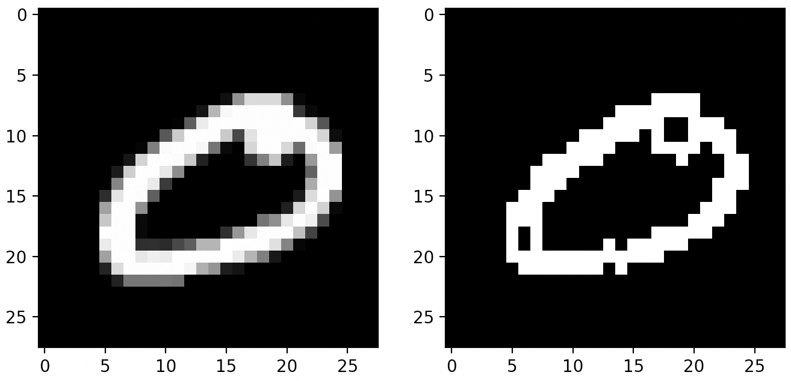
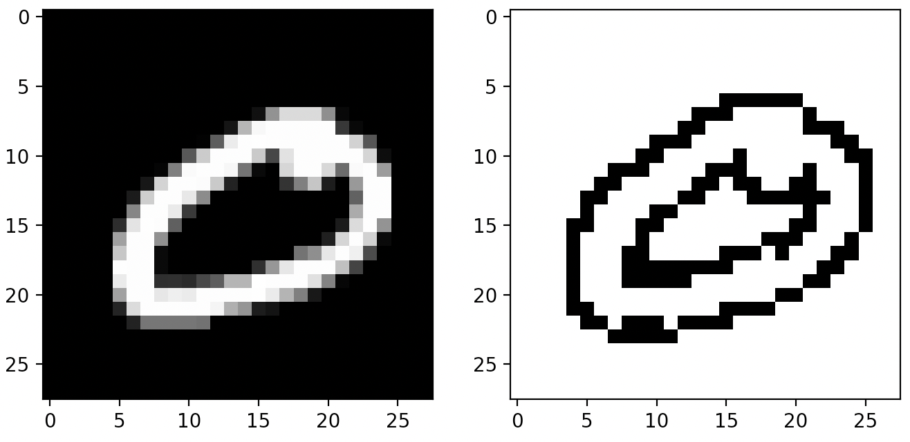

# AdaptiveThresholdEstimiterについて

目的関数に応じてMethod, BlockSize, Cを決めてくれる．

### 必要なライブラリ

```python
matplotlib
optuna
numpy
opencv-python
```

### 使い方 - import

実行環境と同じディレクトリに`estimiter.py`を配置して

```python
from estimiter import AdaptiveThresholdEstimiter
```

### 使い方 - インスタンス生成

評価関数を渡してインスタンスを生成する．`cv2.adaptiveThreshold()`を実行後，画像を評価して値を導出する．この値が最大化/最小化するように`AdaptiveThresholdEstimiter`は動作する．

```python
ate = AdaptiveThresholdEstimiter(
  evaluate_function, # 評価関数
  direction          # 最大化('maximize') or 最小化('minimize')の文字列
)
```

### 使い方 - 評価関数

```python
from estimiter import count_area # cv2.findContours()を利用してcontoursの個数が小さくなるようにする(direction = 'minimize'にする)
from estimiter import augment_area # cv2.findContours()を利用して最大のcontoursの面積を大きくする(direction = 'maximize'にする)
```

`main.py`にも`augment_area2`を実装している．画像全体のピクセル数`img.shape[0] * img.shape[1]`から非ゼロピクセル数`np.count_nonzero(img)`を引いて，ゼロ値を持つピクセル数をカウントする．`direction = 'maximize'`は下記画像1枚目と同様の結果になり，`direction = 'minimize'`は下記画像2枚目と同様の結果になる．

関数の実装によっては，人の主観評価を入力して評価できるように，画像表示と値入力を組み込むこともできる．

### 使い方 - fit

画像`imgs`を渡して最適なMethod, BlockSize, Cを導出させる．内部でベイズ最適化ライブラリ`optuna`を利用する．

```python
ate.fit(imgs, n_trials = 50)
```

ここで`len(imgs.shape)`は3である必要がある．`imgs.shape = (N, H, W)`の形式であること．`n_trials`の数だけ調査する．

### 使い方 - 最適化の結果

```python
pred_imgs = ate.predict(imgs) # 全ての画像に最適化されたcv2.adaptiveThreshold()を実行する
pred_img = ate._predict_one(imgs[0]) # imgsのうち1枚にcv2.adaptiveThreshold()を実行する
print(ate.best_params_) # 最適化されたMethod, BlockSize, Cを表示する
```

# 実験ログ

* Method:
  * GAUSSIANしか勝たん
* Block Size:
  * 小さい場合: キャニー変換みたいなエッジ検出になる
  * 大きい場合: サイズ未満の箇所が抜かれる
* C:
  * 負: 元々`0`だった場所は`0`になる
  * 正: 元々`0`だった場所は`255`になる

`Block Size = 3, C = -10`の場合



そも，少し値があれば`255`にしたい，みたいな要望であれば`0`か否かで2値化するとか，普通の`cv2.threshold(img, 1, 255, cv2.THRESH_BINARY)`のようにして`1`をボーダーにするとかが良さげ．

そうでないのなら`cv2.adaptiveThreshold()`を使う価値があるかも．下の例は`Block Size = 3, C = 10`の場合



## 
